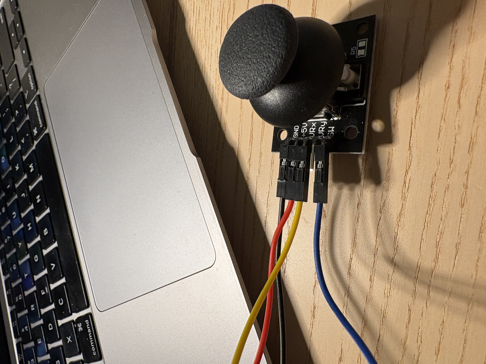
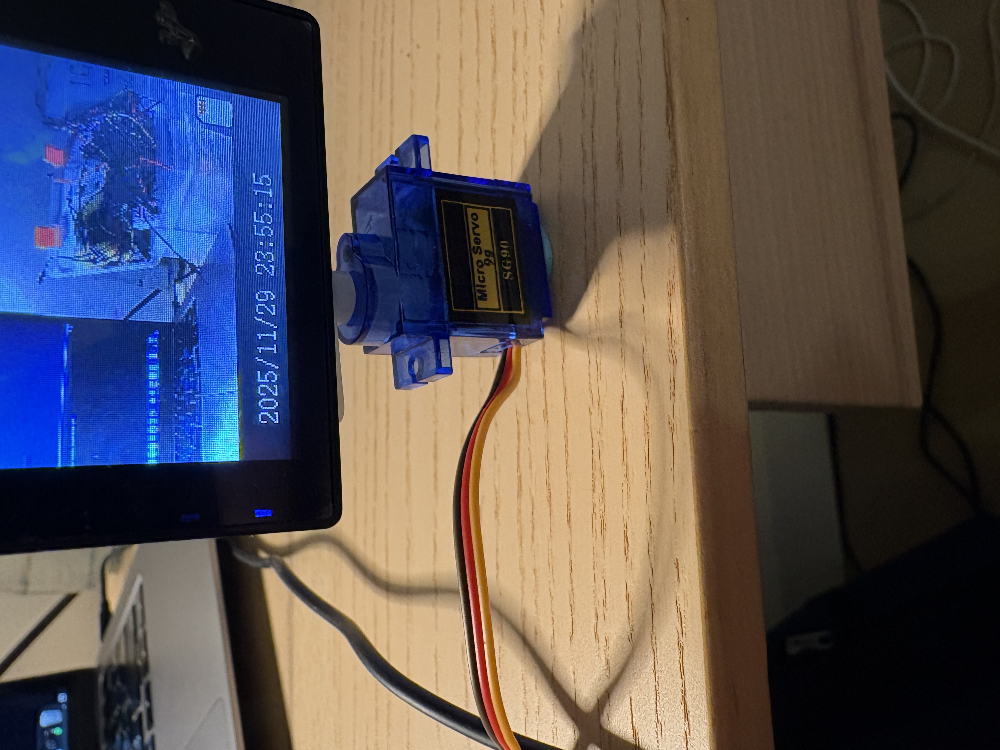

# arduino-servo-control

## Overview
Developed an Arduino-based system that uses joystick input to control the angle of a servo motor, which adjusts the direction of a mounted camera.

## Features
- Real-time servo control using joystick input  
- Functional application as a simple camera positioning mount  

## Components
- Arduino Uno  
- Servo motor  
- Joystick module  
- Breadboard and jumper wires
- Camera
- Sticky tack 

## How It Works
The joystick provides analog input values (X-axis) to the Arduino. These values are read using analog pins and mapped to corresponding servo angles (0–180°). The Arduino then sends PWM signals to the servo motor to adjust its position accordingly.

## Code NOTES
- Reads analog input using `analogRead()`  
- Maps joystick values using `map()`  
- Controls servo position using the Servo library (`servo.write()`)  

## Demo

### Setup

### Wiring

---

## Video
[Watch Me!](Demonstration.mov)

## Future Adjustments
- Integrate more sensors or components
